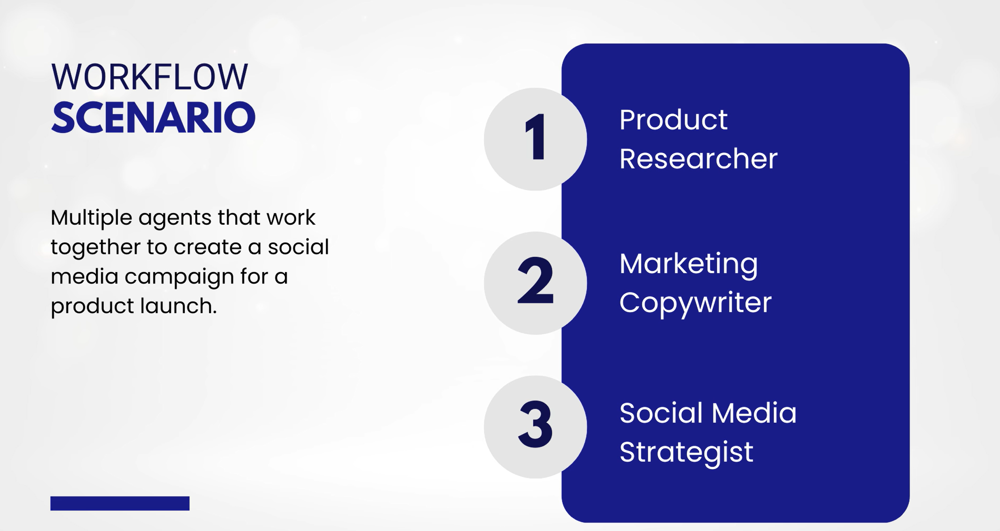

# Microsoft Foundry Workflows

Learn how to create Microsoft Foundry Workflows in this 4-part series.

- Microsoft Foundry Workflows -  Create a Sequential Workflow
- Microsoft Foundry Workflows -  Add Agents with Tools to a Workflow
- Microsoft Foundry Workflows -  Migrate to VS Code Web
- Microsoft Foundry Workflows -  Migrate to VS Code Local

Try it yourself in Microsoft Foundry: [ai.azure.com](https://ai.azure.com)

## Prerequisites

- A [Microsoft Foundry](https://ai.azure.com) project

## Access the Agent Assets

Navigate to the folder: `cd Samples/Workflows`. The Contoso Electronics products are available in the `products` folder. The system messages for the agents are available in the `system-messages` folder. The Contoso Branding Guidelines are available in `contoso-electronics-branding`.

## View the Social Media Campaign example

To view the Social Media Campaign file generated by the agents, open the `social-media-campaign.md` file.